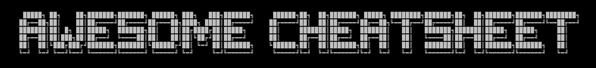

> 超级速查表 - 编程语言、框架和开发工具的速查表，单个文件包含一切你需要知道的东西 :zap:

 
 
 

​                                                                                      

## 最好用的中文速查表（Cheatsheet）

当年学习 Linux 时就是靠着一张常用命令小卡片，敲啥命令忘记了，经常拿起来看看，后来知道这玩意儿叫做速查表（Cheatsheet），于是开始有意识收集和整理各种常用的速查表。对于很多工具来说，看书和大篇大篇的文章都太浪费时间了，其实大部分时候，你只需要一张小巧的表格就够了。

最近看 LeCoupa 的 [LeCoupa/awesome-cheatsheets](https://github.com/LeCoupa/awesome-cheatsheets) 项目有所启发，感于网上中文资料匮乏，且质量参差不齐，决定做一个中文的 Cheatsheet 项目，收集整理常用的：编程语言、框架和开发工具的 Cheatsheet 进行收集和整理。数量不求多，但每个表都得做好做透，让你不用再网上漫无目标的搜索文章，一个简单的 Cheatsheet 文件就彻底满足你。

## :zap:内容索引

### :page_with_curl:编程语言

- [Bash](languages/bash.sh)
- [Go](languages/golang.go)
- [Php](languages/php.php)
- [VimScript](languages/vimscript.md)
- [Python](languages/python.md)

### :wrench:开发工具

- [Gdb](tools/gdb.txt)
- [Adb](tools/adb.txt)
- [Tmux](tools/tmux.txt)
- [Git](tools/git.txt)
- [FFmpeg](tools/ffmpeg.sh)

### :pencil:文本编辑

- [VIM](editors/vim.txt)
- [Nano](editors/nano.txt)

## :pray:感谢贡献

本项目的存在，离不开参与贡献的网友们，感谢：

希望把你的名字和头像列在这里么？欢迎把你熟悉的编程语言、框架和工具的常用知识点做成 cheatsheet 用 PR 发过来。

<!--

### 支持者们

感谢支持者 🙏 [[成为支持者](https://opencollective.com/awesome-cheatsheets#backer)]

-->

支持本项目，除了贡献代码，还能成为一名 sponsor，你的图标会显示在这里，点击可以跳转到你的主页 [[成为赞助者](https://opencollective.com/awesome-cheatsheets#sponsor)]

